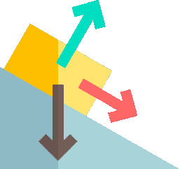

| **`Documentation`** |
| --- |
|  | 

## Basics
- Linear Physics
   - - [x] Vectors
   - - [x] Uniformly Accelerated Rectilinear Motion
   - - [x] Forces

- Angular Physics
   - - [x] Rotation
   - - [x] Force (Torque)

- Collision
   - - [x] Point
   - - [x] Box
   - - [x] Sphere

## Utils
   - - [x] Math
   
## Extras
   - - [ ] Rig (Hook)
   - - [ ] Wheels
