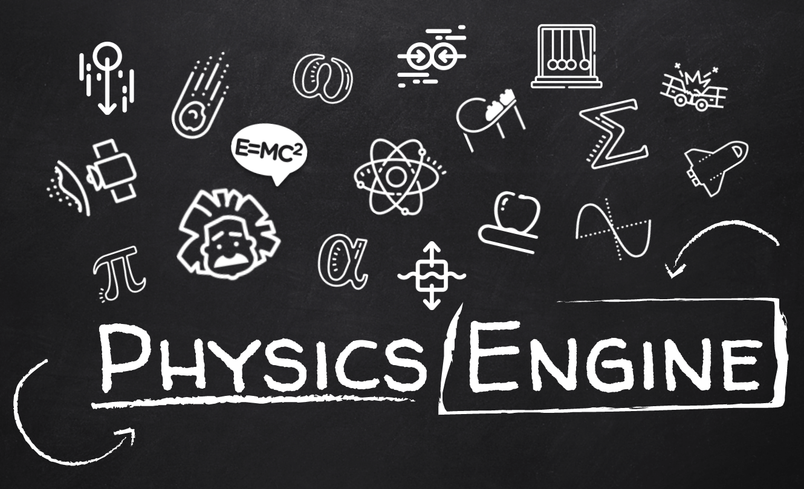

	

		
	

| **`Build`** | **`Documentation`** | **`Issues`** | **`Contributors`** |
| --- | --- | --- | --- |
|  |  |  | 

## Basics
- Linear Physics
   - - [x] Vector
   - - [x] Uniformly Accelerated Rectilinear Motion
   - - [x] Forces

- Angular Physics
   - - [x] Matrix
   - - [x] Quaternion
   - - [x] Rotation
   - - [x] Force (Torque)

- Collision
   - - [x] Point
   - - [x] Sphere
   - - [x] Cube

## Utils
   - - [x] Mathematics
   
## Extras
   - - [ ] Rig (Hook)
   - - [ ] Wheels

## Team members
[Ana Laura](http://www.linkedin.com/in/laura-meira-36aa9313a) 
[Gabriel Habran](https://www.linkedin.com/in/gabriel-augusto-mendes-habran-66ba20176) 
[Isabelle Oliveira](https://www.linkedin.com/in/1sabelle0liveira) 
[Jaelcio Dutra](https://www.linkedin.com/in/jaelcio-dutra) 
[Marcelo Chaves](https://www.linkedin.com/in/marcelochaves95) 
[Natã Batista](https://www.linkedin.com/in/nat%C3%A3-batista-brand%C3%A3o-51495967) 
[Roque Anderson](https://www.linkedin.com/in/roque-anderson-88a787101)
## License
Apache 2.0 license. See the [`LICENSE`](LICENSE) file for details.
